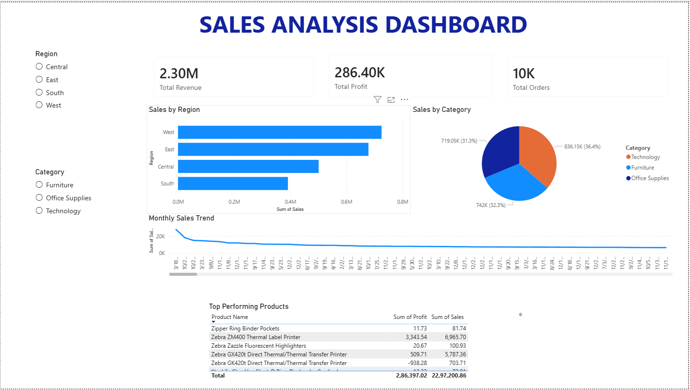

# 📊 Sales Analysis Dashboard – Power BI Project

## 🚀 Project Overview

This project is an interactive **Sales Analysis Dashboard** developed using **Power BI** as part of **Project 1** during my **Data Analyst Internship at SkillinfyTech IT Solutions**.

The dashboard is designed to transform raw sales data into meaningful business insights through data visualization, KPI tracking, trend analysis, and interactive reporting. It demonstrates practical skills in **data analytics, Excel data handling, dashboard development, and business intelligence reporting**.

---

# 🎯 Objective

The main objective of this project is to:

* Analyze sales performance across regions and categories
* Monitor revenue, profit, and order metrics
* Identify sales trends and top-performing products
* Build an interactive dashboard for business decision-making

---

# 🛠 Tools & Technologies Used

## 📌 Power BI

* Interactive Dashboard Creation
* Data Visualization
* KPI Reporting
* Data Modeling
* Slicers & Filters
* DAX Measures

## 📌 Microsoft Excel

* Data Cleaning
* Data Formatting
* Sorting & Filtering
* Lookup & Aggregation
* Dataset Preparation
* Basic Data Analysis

---

# 📈 Dashboard Features

## ✅ KPI Cards

Displays:

* Total Revenue
* Total Profit
* Total Orders

---

## ✅ Regional Sales Analysis

Interactive bar chart showing sales distribution across:

* East
* West
* Central
* South

---

## ✅ Category-Wise Analysis

Pie chart visualization comparing:

* Technology
* Furniture
* Office Supplies

---

## ✅ Monthly Sales Trend

Line chart used to analyze:

* Sales performance over time
* Revenue patterns
* Business growth trends

---

## ✅ Top Performing Products

Interactive table displaying:

* Product Name
* Sales Amount
* Profit Generated

---

## ✅ Interactive Slicers

Users can dynamically filter dashboard data using:

* Region Filter
* Category Filter

---

# 📊 Key Insights Generated

* West region recorded the highest sales performance
* Technology category contributed the largest revenue share
* Certain products generated high sales but low profit margins
* Monthly sales trends highlighted performance fluctuations over time

---

# 🧠 Skills Demonstrated

## 📌 Data Analytics Skills

* Data Interpretation
* Business Intelligence Reporting
* Insight Generation
* Trend Analysis

## 📌 Power BI Skills

* Dashboard Design
* Visual Storytelling
* Interactive Reporting
* KPI Development
* DAX Calculations

## 📌 Excel Skills

* Data Cleaning
* Data Preparation
* Spreadsheet Management
* Analytical Functions
* Dataset Structuring

---

# 📂 Project Structure

```text
sales-analysis-dashboard/
│
├── Sales-Analysis-Dashboard.pbix
├── README.md
└── screenshots/
    └── dashboard-preview.png
```

---

# 📷 Dashboard Preview

*Add dashboard screenshot here*

```markdown


```

---


---

# 💼 Internship Information

### Organization:

**SkillinfyTech IT Solutions**

### Role:

**Data Analyst Intern**

### Project:

**Project 1 – Sales Analysis Dashboard**

---

# 👨‍💻 Author

## Rishit Verma

Aspiring Data Analyst passionate about:

* Data Analytics
* Business Intelligence
* Dashboard Development
* Automation & AI

---

# ⭐ Recruiter Notes

This project demonstrates practical understanding of:

* Business analytics workflows
* Dashboard reporting
* Data visualization principles
* Excel-based data preprocessing
* Real-world KPI monitoring

The dashboard was designed with a focus on:
✅ Clean UI/UX
✅ Interactive reporting
✅ Business-oriented insights
✅ Professional dashboard structuring

---


## LinkedIn

https://www.linkedin.com/in/rishitvermaa

---

# ⭐ If You Like This Project

Feel free to fork this repository, give it a ⭐, and connect with me for collaboration opportunities.
